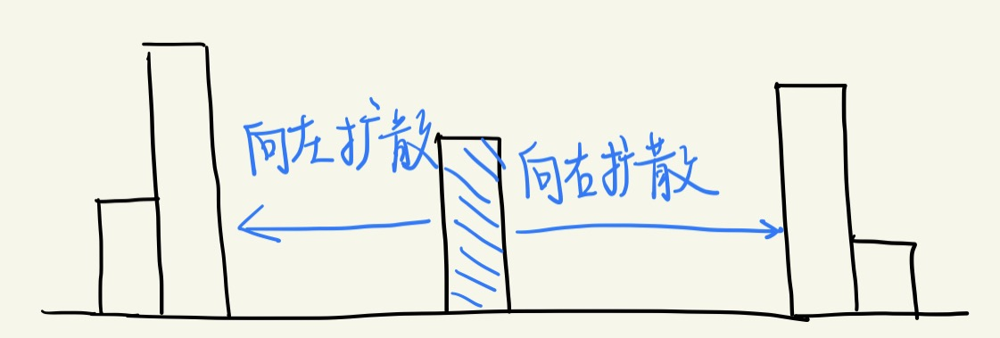

这道题的基础思想是：**从当前位置向左右两边扩散，直到不能扩散（向两边扩散时遇到的第一个高度严格小于当前高度的矩形块）为止，算出来高度和宽度，进而计算面积，求最大值。**



第一种暴力解法就是采用这种思想，依次遍历每个位置。

第二种思想其实是采用了 `单调栈` 数据结构提高执行效率。在这种解法中，后一个压入栈中元素的高度一定大于等于前一个压入栈中元素的高度。当扫描到的矩形块高度严格小于栈顶元素的高度时，说明无法再扩散（向右扩散截至），进入到清算环节（通过出栈的方式向左扩散），也就是一定有某一个块达到了最大矩形。

这里为什么可以用单调栈来提升效率呢？从这道题的基本思想出发，栈中某元素A下面的元素一定是它在横轴坐标系中左边的小于等于它的元素，一直压栈，直到遇到某个元素值B比栈顶元素小，这个值**可能**就是A右边的极限（这里一定是B前一个元素向右扩散截至，但未必是A右边的边界，例如5 10 9这个例子，9一定是10的右边界，但不是5的右边界）。所以当B真的是A右边的极限时，那A只需要不断在栈中向左边找第一个小于A值的位置（向左扩散），这个位置就是A左边的极限。

```java
class Solution {
    public int largestRectangleArea(int[] heights) {
        Deque<Integer> stack = new LinkedList<>();
        int len = heights.length;
        // 特例
        if (len == 0) return 0;
        if (len == 1) return heights[0];
        int res = 0;
        for (int i = 0; i < len; i++) {
            // 当遇到当前元素高度比栈顶元素高度小的时候，进入清算环节。
            // 注意：这里是while，而不是if，因为可能设计到多个矩形块的清算
            while (!stack.isEmpty() && heights[i] < heights[stack.peekLast()]) {
                int curHeight = heights[stack.pollLast()];
                while (!stack.isEmpty() && heights[stack.peekLast()] == curHeight) {
                    stack.pollLast();
                }
                int curWidth;
                if (stack.isEmpty()) {
                    curWidth = i;
                } else {
                    curWidth = i - stack.peekLast() - 1;
                }
                res = Math.max(res, curWidth * curHeight);
            }
            stack.addLast(i);
        }
        while (!stack.isEmpty()) {
            int curHeight = heights[stack.pollLast()];
            while (!stack.isEmpty() && heights[stack.peekLast()] == curHeight) {
                stack.pollLast();
            }
            int curWidth;
            if (stack.isEmpty()) {
                curWidth = len;
            } else {
                curWidth = len - stack.peekLast() - 1;
            }
            res = Math.max(res, curWidth * curHeight);
        }
        return res;
    }
}
```


